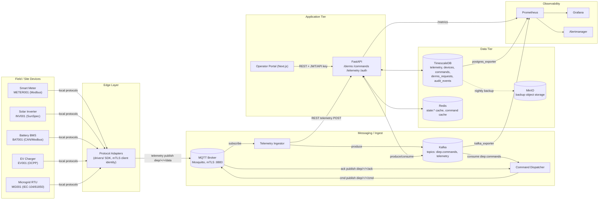
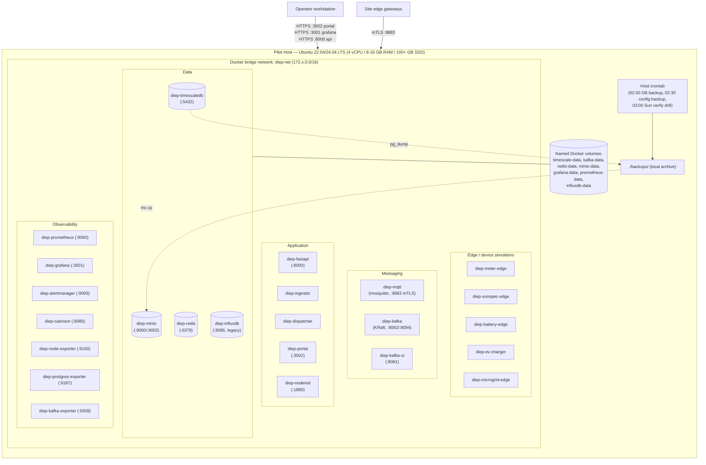
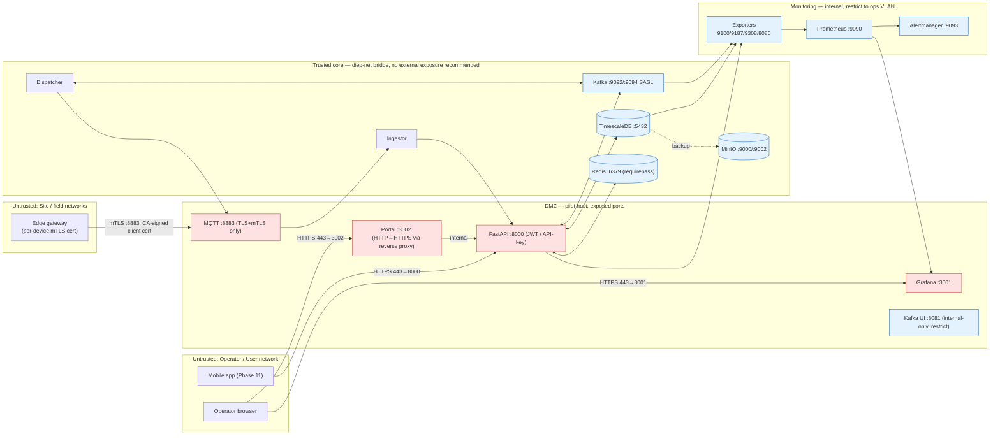
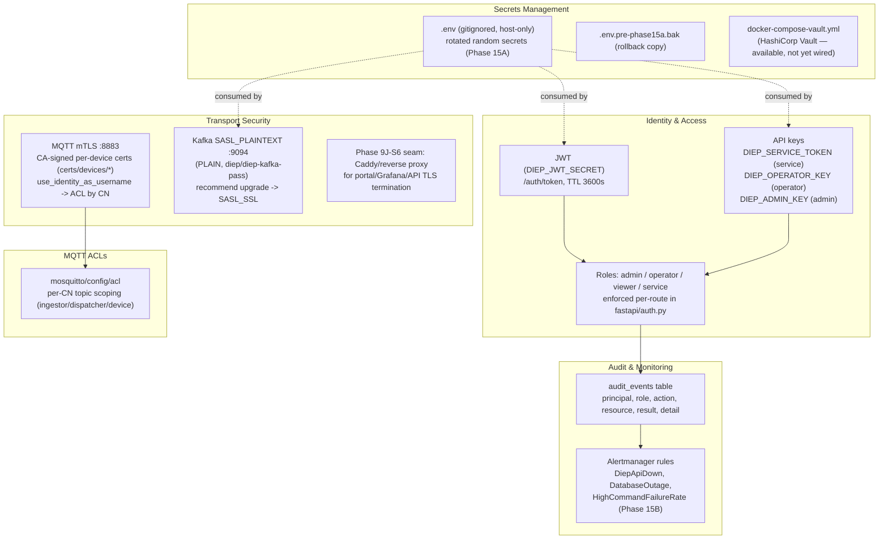

# DIEP Deployment Architecture (Phase 16, Task 1)

**Date:** 2026-06-13
**Scope:** Pilot deployment architecture — logical, physical, network, and security views —
for the DIEP platform as it exists today (single-host `docker compose` lab, 25 containers,
readiness ≈ 88/100 after Phases 15A/15B/15C). Documentation only; no code, configuration,
or running services were changed to produce this document.

Diagram sources:
- [`diagrams/01_logical_architecture.mmd`](diagrams/01_logical_architecture.mmd)
- [`diagrams/02_physical_architecture.mmd`](diagrams/02_physical_architecture.mmd)
- [`diagrams/03_network_architecture.mmd`](diagrams/03_network_architecture.mmd)
- [`diagrams/04_security_architecture.mmd`](diagrams/04_security_architecture.mmd)
- [`diagrams/diep_deployment_architecture.drawio`](diagrams/diep_deployment_architecture.drawio) — physical deployment, open in [diagrams.net](https://app.diagrams.net) (File → Open from Device)

---

## 1. Logical architecture

DIEP is a layered telemetry/command pipeline: field devices → edge protocol adapters →
MQTT (mTLS) → ingestor/dispatcher → Kafka → FastAPI → TimescaleDB/Redis, fronted by an
operator portal and Grafana, with Prometheus/Alertmanager for monitoring.

### 1.1 Component summary

| Layer | Components | Purpose |
|---|---|---|
| Field | METER001, INV001, BAT001, EV001, MG001 (+ test variants BAT900/MGC900/etc.) | Physical/simulated DERMS assets |
| Edge | `drivers/` protocol adapter SDK, per-device mTLS client certs (`certs/devices/*`) | Normalize device protocols into MQTT telemetry/cmd/ack topics |
| Messaging | `diep-mqtt` (Mosquitto, mTLS-only on 8883), `diep-kafka` (KRaft, single broker) | Pub/sub transport for telemetry and commands |
| Ingest/Dispatch | `diep-ingestor`, `diep-dispatcher` | Bridge MQTT ↔ Kafka ↔ FastAPI for telemetry and command round-trips |
| Application | `diep-fastapi` (REST API, auth, DERMS logic), `diep-portal` (Next.js operator UI), `diep-nodered` (flow automation) | Business logic, operator UX |
| Data | `diep-timescaledb` (system of record), `diep-redis` (live state cache), `diep-minio` (backup object store) | Persistence and caching |
| Observability | `diep-prometheus`, `diep-grafana`, `diep-alertmanager`, `diep-cadvisor`, `diep-node-exporter`, `diep-postgres-exporter`, `diep-kafka-exporter` | Metrics, dashboards, alerting |

---

## 2. Physical deployment architecture

The current pilot runs as a **single-host `docker compose` stack** (25 containers) on one
Linux VM/host. All containers share one bridge network (`diep-net`) and seven named Docker
volumes for persistent state.

### 2.1 Current host profile (live-measured)

| Resource | Total | In use (steady-state, 25 containers) |
|---|---|---|
| CPU | 4 vCPU | ~25-35% aggregate (cAdvisor itself is the heaviest single consumer at ~80% of 1 core) |
| Memory | 7.2 GiB | ~4.8 GiB used (Kafka ~490 MiB, cAdvisor ~740 MiB, Portal ~320 MiB largest consumers) |
| Disk | 48 GB | 26 GB used / 21 GB free |

This profile is adequate for a **pilot with ≤ ~10 simulated/real devices**. See
[`DIEP_INSTALLATION_GUIDE.md`](DIEP_INSTALLATION_GUIDE.md) §1 for sizing recommendations
for a customer pilot (real devices + headroom for compression/retention).

### 2.2 Container inventory by tier

| Tier | Containers |
|---|---|
| Edge/simulators | `diep-meter-edge`, `diep-sunspec-edge`, `diep-battery-edge`, `diep-ev-charger`, `diep-microgrid-edge` |
| Messaging | `diep-mqtt`, `diep-kafka`, `diep-kafka-ui` |
| Application | `diep-fastapi`, `diep-ingestor`, `diep-dispatcher`, `diep-portal`, `diep-nodered` |
| Data | `diep-timescaledb`, `diep-redis`, `diep-minio`, `diep-influxdb` (legacy, no Grafana datasource — see §6) |
| Observability | `diep-prometheus`, `diep-grafana`, `diep-alertmanager`, `diep-cadvisor`, `diep-node-exporter`, `diep-postgres-exporter`, `diep-kafka-exporter` |

---

## 3. Network architecture

### 3.1 Port inventory (as currently bound in compose files)

| Port | Service | Exposure recommendation for pilot |
|---|---|---|
| 8883/tcp | MQTT (mTLS only, `allow_anonymous false`) | **Expose** to site/edge gateway network only (firewalled to known gateway IPs) |
| 8000/tcp | FastAPI REST API | Expose behind TLS reverse proxy (Caddy/Phase 9J-S6 seam); JWT/API-key enforced |
| 3002/tcp | Operator Portal | Expose behind TLS reverse proxy |
| 3001/tcp | Grafana | Expose behind TLS reverse proxy; restrict to operator/ops VLAN |
| 9093/tcp | Alertmanager | Internal only |
| 9090/tcp | Prometheus | Internal only |
| 9092, 9094/tcp | Kafka (PLAINTEXT internal, SASL_PLAINTEXT app) | **Do not expose externally**; internal `diep-net` only |
| 5432/tcp | TimescaleDB | **Do not expose externally**; internal only |
| 6379/tcp | Redis (requirepass enabled, Phase 15A) | **Do not expose externally**; internal only |
| 9000/9002/tcp | MinIO API/console | Internal only (used by backup scripts) |
| 8081/tcp | Kafka UI | Internal/ops-only — no auth in front of it today |
| 1880/tcp | Node-RED | Internal/ops-only |
| 8086/tcp | InfluxDB (legacy, unused by Grafana) | Internal only; candidate for removal (§6 of Task 5 report) |
| 8080, 9100, 9187, 9308/tcp | cAdvisor, node-exporter, postgres-exporter, kafka-exporter | Internal/ops VLAN only |
| 1883, 9001/tcp | Legacy MQTT plaintext/WS listeners | **Retired since Phase 9J-S4** (commented out in `mosquitto.conf`); the root `docker-compose.yml` still maps these host ports for the `mqtt` service — recommend removing the port mappings before pilot to avoid exposing unused listener ports |

### 3.2 Pilot deployment recommendation

For a customer pilot site:
1. Place the host behind a firewall/NAT; only forward **8883** (device gateways), and
   **443** to a TLS reverse proxy that fronts Portal (3002), Grafana (3001), and the API (8000).
2. All data-tier and messaging-internal ports (5432, 6379, 9000/9002, 9092/9094, 8081)
   stay bound to `127.0.0.1`/the bridge network — never to `0.0.0.0` on a routable interface.
3. Monitoring ports (9090/9093/9100/9187/9308/8080) are reachable only from an
   operations/management VLAN (VPN or jump host).

---

## 4. Security architecture

### 4.1 Security controls summary

| Control | Status | Notes |
|---|---|---|
| API authentication | ✅ Live | JWT (`/auth/token`) + static API keys (service/operator/admin), `DIEP_AUTH_ENFORCED=1` |
| RBAC | ✅ Live | admin/operator/viewer/service roles enforced per-route |
| MQTT transport security | ✅ Live | mTLS-only on 8883, `allow_anonymous false`, CN-based identity + ACL (Phase 9J-S4) |
| Kafka authentication | ✅ Live (SASL_PLAINTEXT) | recommend SASL_SSL for production (encryption in transit) |
| Redis authentication | ✅ Live | `requirepass` since Phase 15A |
| Secrets rotation | ✅ Done | all placeholder `change-me-*` secrets rotated (Phase 15A); `DIEP_ADMIN_PASSWORD`/`DIEP_OPERATOR_PASSWORD`/`DIEP_VIEWER_PASSWORD`/`DIEP_ACME_PASSWORD`/`DIEP_GLOBEX_PASSWORD` still default — **rotate before customer pilot** |
| Secrets storage | ⚠️ `.env` file on host | Vault compose file exists but not wired; acceptable for single-host pilot with restricted file permissions |
| Audit trail | ✅ Live | `audit_events` table captures command/DERMS actions with principal/role/result; auth events (`/auth/token`, `/auth/whoami`) not yet audited |
| Backup encryption | ⚠️ Not yet | backups stored in MinIO/local archive unencrypted — acceptable in lab, recommend SSE for pilot if backups leave the host |
| TLS for Portal/Grafana/API | ⏳ Seam ready | Caddy reverse-proxy pattern exists (`caddy/Caddyfile`, Phase 9J-S6 seam) but HTTP-only in the lab — **enable TLS termination before exposing to a customer network** |

---

## 5. Cross-references

- HA target architecture and migration stages: [`DIEP_HA_ARCHITECTURE.md`](DIEP_HA_ARCHITECTURE.md)
- Backup/DR procedures: [`PHASE15C_PRODUCTION_OPERATIONS_REPORT.md`](PHASE15C_PRODUCTION_OPERATIONS_REPORT.md)
- Security hardening history: [`PHASE15A_SECURITY_HARDENING_REPORT.md`](PHASE15A_SECURITY_HARDENING_REPORT.md)
- Monitoring hardening: [`PHASE15B_MONITORING_HARDENING_REPORT.md`](PHASE15B_MONITORING_HARDENING_REPORT.md)
- Edge gateway hardware options: [`DIEP_EDGE_GATEWAY_ARCHITECTURE.md`](DIEP_EDGE_GATEWAY_ARCHITECTURE.md)
