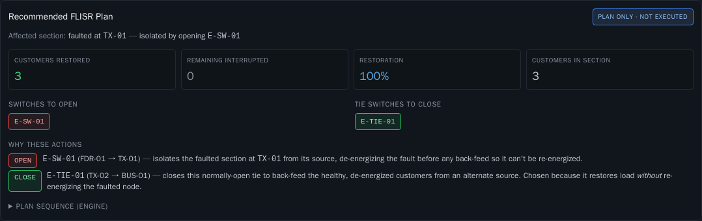
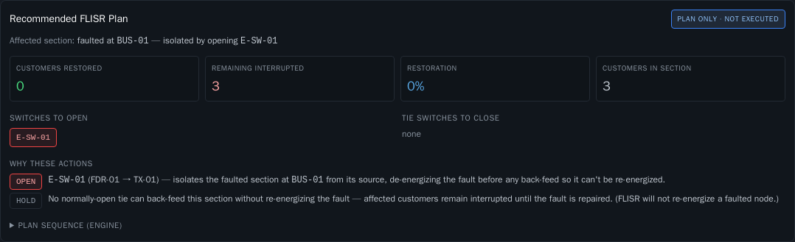
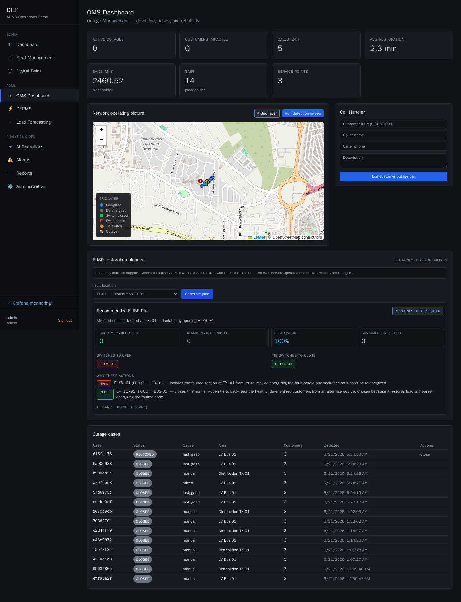

# OMS FLISR Restoration Planner (read-only) — Step 2

An operator decision-support panel on the **OMS Dashboard** (`/oms`), beneath the
grid overlay from step 1. It computes a **Fault Location, Isolation & Service
Restoration** plan for a chosen fault and presents it as a clearly-labelled
**"Recommended FLISR Plan"** — strictly read-only.

## Read-only contract

- Calls **`POST /dms/flisr/simulate` with `execute=false` only**. The engine plans
  on an in-memory copy of the network model and **never operates a switch**.
- **No switching/execution capability is exposed** — there is deliberately no
  execute button, no switch toggle, no Volt/VAR control.
- **No live state mutation.** `execute=false` leaves `grid_edges` untouched
  (verified below). The single server-side write is the simulation's own
  `flisr_events` **audit record** (`executed=false`) — a log that a what-if plan
  was computed, not a grid/operational change. Because of that audit write the
  panel is **operator-initiated (a click), not polled**, so it does not spam the
  log.
- Role: the endpoint requires operator/engineer/admin. A viewer gets a friendly
  "requires operator role or higher" message instead of a plan.

## What it displays

From the `flisr/simulate` response:

- **Affected feeder/section** — the fault node and the switch that isolates it.
- **Switches to open** — `isolated_edges` (red chips).
- **Tie switches to close** — `restored_edges` (green chips; these are the
  normally-open ties used to back-feed).
- **Customers restored**, **remaining interrupted**, and **restoration %**
  (`restored / customers-in-section`), plus customers in the section.
- **Why these actions** — an operator-facing explanation per switch:
  - **OPEN** → "isolates the faulted section … de-energizing the fault before any
    back-feed so it can't be re-energized."
  - **CLOSE** → "back-feed the healthy, de-energized customers from an alternate
    source … restores load *without* re-energizing the faulted node."
  - **HOLD** (when no tie qualifies) → "FLISR will not re-energize a faulted node."
- **Plan sequence (engine)** — the authoritative server `steps`, collapsible.

The fault selector defaults to an active outage's node when one exists, else a
sensible isolable default (`TX-01`).

## Files

| File | Change |
|---|---|
| `portal/components/FlisrPlanner.tsx` | New read-only planner: fault selector, on-click `execute=false` call, plan rendering + per-action rationale. |
| `portal/app/oms/page.tsx` | Mounts the planner in a new "FLISR restoration planner" section below the map; existing KPIs/Call Handler/map/cases untouched. |

## Validation

**Plan-only, no mutation** (admin token, live API):

```
POST /dms/flisr/simulate {fault_node: TX-01, execute: false}
 → isolate ['E-SW-01'] | restore ['E-TIE-01'] | restored 3 | still_out 0 | executed False
post-plan: E-SW-01 still CLOSED = True | E-TIE-01 still OPEN = True   # grid_edges unchanged
```

**Safety case** — fault at `BUS-01`: the only candidate tie (`E-TIE-01`) would
re-energize the faulted bus, so it is refused → 0 restored, 3 remaining, 0%, HOLD.

**Behavior**
- Portal compiled `/oms` clean, no new console errors.
- Existing OMS workflows unchanged: KPIs, active-outage map + grid overlay, Call
  Handler, detection sweep, and case table all still function.
- Regression suite: 27/27 pass (unchanged — no API or schema change).

## Screenshots

**Recommended FLISR Plan — restorable fault (`TX-01`):**



**Safety case — fault on the bus (`BUS-01`), no safe back-feed:**



**Full dashboard — planner integrated below the step-1 grid overlay:**


