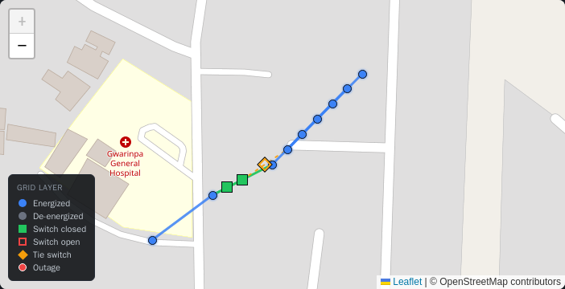
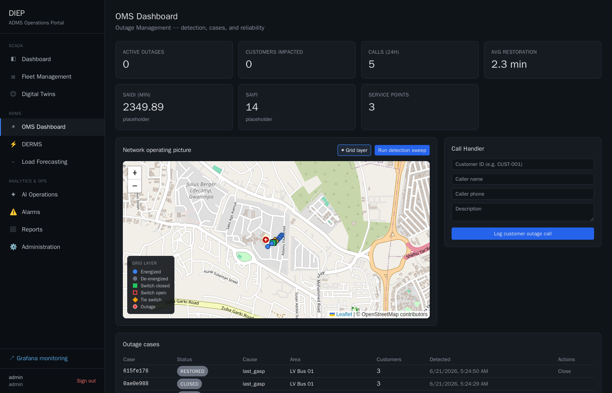
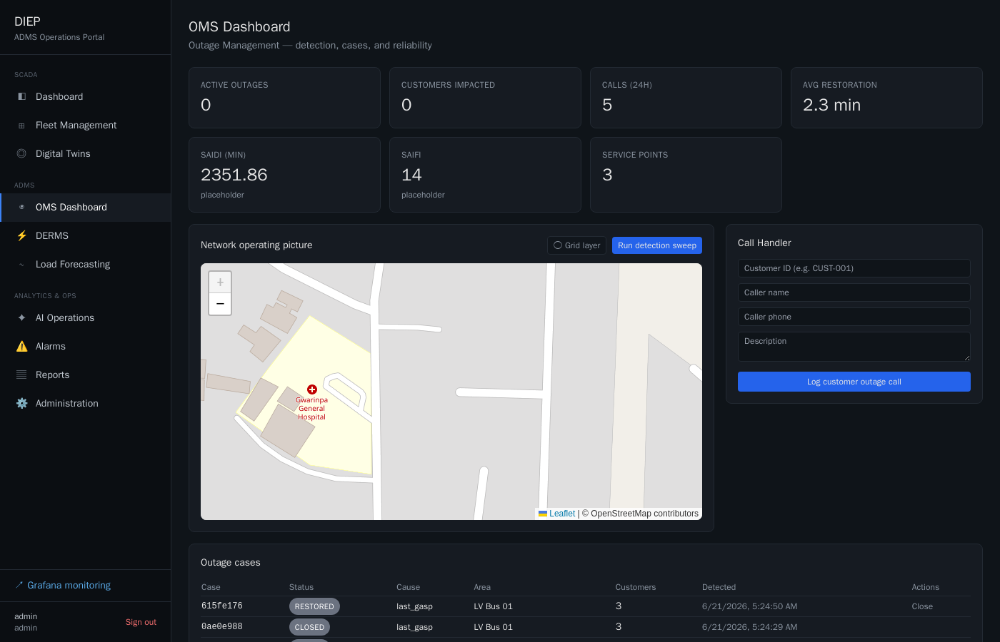

# OMS Grid & Switch Overlay (read-only) — Step 1

A read-only network operating picture on the **OMS Dashboard** (`/oms`): the
canonical grid topology and live switch state drawn over the existing active-outage
map, behind a layer toggle. This is the visualization foundation that a later
change can build switching actions on — **it introduces no control or execution
capability** (no FLISR execute, no Volt/VAR controls, no switch operate).

## What it shows

Sourced entirely from **`GET /topology/graph`** (nodes + edges), nothing else:

- **Nodes** — `grid_nodes` with coordinates, colored by energization.
- **Edges** — `grid_edges` drawn as lines; conductors colored by whether they are
  carrying.
- **Switch state** — switch edges rendered green (closed) / red dashed (open) with
  a square state marker at the midpoint.
- **Tie switches** — drawn distinctly in amber with a diamond marker (normally-open
  tie), so a tie is identifiable even when, like a regular switch, it is open.
- **Energized vs de-energized** — computed client-side: BFS from substation
  source(s) over **closed** edges only (a closed conductor energizes both ends, so
  the closed-edge graph is treated as undirected). This mirrors the server-side
  `_reach` the DMS uses, but needs nothing beyond the graph endpoint.
- **Tooltips** — hover a node for `id · type · kV · energized|de-energized`; hover a
  switch/tie or its conductor for `id · type · OPEN|CLOSED · normally open/closed`.
- **Legend** — energized, de-energized, switch-closed, switch-open, tie-switch (and
  outage) keyed to the colors/shapes on the map.
- **Layer toggle** — "◉ Grid layer" button in the panel header shows/hides the whole
  overlay. Outage markers are unaffected and always render on top.

## Files

| File | Change |
|---|---|
| `portal/components/OutageMap.tsx` | Optional read-only grid overlay (nodes/edges/switch+tie markers, energization BFS, legend). Outage markers preserved, raised above the grid. |
| `portal/app/oms/page.tsx` | Polls `/topology/graph`, adds the "Grid layer" toggle, passes `grid`/`showGrid` to the map. Existing KPIs, Call Handler, case table, detection sweep untouched. |

## Validation

**Topology rendered** (from the live `GET /topology/graph`, Abuja Site A):

- 11 nodes / 10 edges. Substation `SUB-ABUJA` → feeder `FDR-01` → switches `E-SW-01`
  (→`TX-01`) and `E-SW-02` (→`TX-02`) → `BUS-01` → 5 leaf nodes
  (METER001 / BAT001 / INV001 / EV001 / MG001).
- **Switches** `E-SW-01`, `E-SW-02`: closed → green. **Tie** `E-TIE-01`
  (`TX-02`→`BUS-01`, normally open, `is_closed=false`): amber dashed + diamond.
- **Energization:** all nodes reachable from `SUB-ABUJA` over closed edges are blue
  (energized); `ND-MGD900` (DNP3 RTU, no edges/coords) is not drawn — it has no
  path and no location.

**Behavior checks**

- Portal compiled `/oms` with no errors (`✓ Compiled /oms`), no new console errors.
- Toggle hides/shows the overlay; outage markers and all existing OMS controls
  remain functional with the layer on or off.
- Read-only: the component imports no command/PATCH/POST paths; the only network
  call it adds is the `GET /topology/graph` poll.

**Independent re-verification of the energization BFS** (same input as the UI):

```
SUB-ABUJA(src) → FDR-01 → {TX-01 via E-SW-01(closed), TX-02 via E-SW-02(closed)}
TX-01 → BUS-01 (E-TX-BUS closed);  E-TIE-01 (TX-02→BUS-01) OPEN, not traversed
⇒ energized: SUB-ABUJA, FDR-01, TX-01, TX-02, BUS-01, + BUS-01's 5 leaves
⇒ de-energized: (none with coords in this seed)
```

## Screenshots

Captured authenticated (admin) via headless Chromium against the live portal
(`/oms`), 2026-06-21.

**Zoomed detail — the operating picture** (`oms-grid-detail.png`):



Blue energized nodes and conductors trace `SUB-ABUJA → FDR-01 → TX-01/TX-02 →
BUS-01 →` leaves; the two **green squares** are the closed switches `E-SW-01` /
`E-SW-02`; the **amber diamond** is the normally-open tie `E-TIE-01`, drawn
distinctly. The legend keys every state.

**Full dashboard, grid layer ON vs OFF:**

| Grid layer ON | Grid layer OFF |
|---|---|
|  |  |

`oms-grid-on.png` — overlay + legend over the OMS dashboard; KPIs, Call Handler,
and case table intact. `oms-grid-off.png` — overlay toggled off: legend and grid
gone, outage map and all existing OMS controls preserved.

> Base tiles come from OpenStreetMap; the grid vectors/markers/legend are SVG/DOM
> and render independently of tile availability. The small red dot on the basemap
> is an OSM POI, not an outage marker — `/oms/outages` was empty at capture (0
> active outages), so the read-only overlay is the only DIEP layer drawn.
