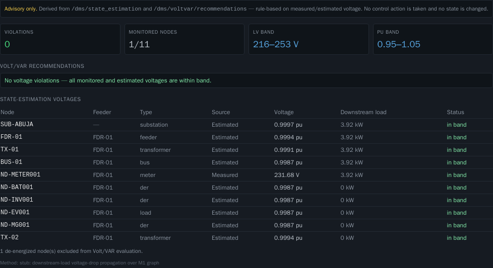
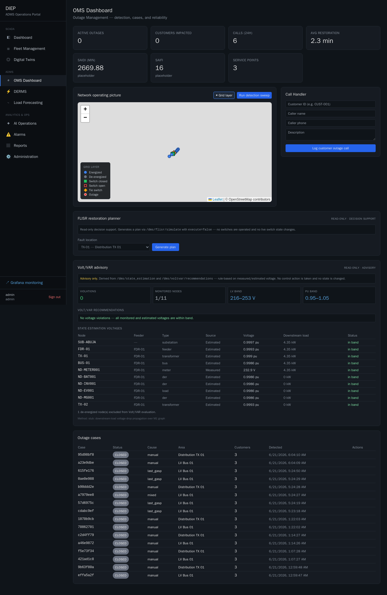

# OMS Volt/VAR Advisory (read-only) — Step 3

A Volt/VAR advisory panel on the **OMS Dashboard** (`/oms`), below the grid
overlay (step 1) and FLISR planner (step 2). It surfaces state-estimation
voltages, any out-of-band violations, and rule-based Volt/VAR recommendations —
**all advisory, no control**.

## Read-only contract

- Reads **existing DMS GETs only**: `GET /dms/state_estimation` and
  `GET /dms/voltvar/recommendations`. Both are read-only and mutate nothing.
- **No execute capability, no control actions, no state mutation** — there is no
  apply/dispatch affordance anywhere in the panel. Every recommendation is tagged
  **Advisory**.
- Polling these GETs is safe (no side effects); the panel refreshes every ~12s.

## What it displays

- **State-estimation voltages** — per energized node: feeder, type, whether the
  value is **Measured** (monitored node) or **Estimated** (stub: downstream-load
  voltage-drop over the M1 graph), the voltage (V measured / pu estimated),
  downstream load, and in-band/out-of-band status.
- **Voltage violations** — nodes outside band are highlighted in the table and
  counted in the summary (`violations`). Bands shown: LV `216–253 V`, pu
  `0.95–1.05` (from the endpoint, env-tunable server-side).
- **Volt/VAR recommendations** — for each violation: the node, **its feeder**, the
  issue (e.g. measured V below band), a raise/lower direction, and the suggested
  action (tap up/down, cap bank, DER VAR support/curtailment). When there are no
  violations the panel says so explicitly.
- **Affected nodes and feeders** — every row and recommendation resolves the node
  to its feeder by walking `parent_id` up the topology graph (from the same
  `/topology/graph` the overlay already loads).

## Files

| File | Change |
|---|---|
| `portal/components/VoltVarAdvisory.tsx` | New read-only panel: state-estimation table, violation highlighting, recommendations, feeder resolution. |
| `portal/app/oms/page.tsx` | Mounts it in a new "Volt/VAR advisory" section below the FLISR planner; map/overlay/planner/cases untouched. |

## Validation

Captured against the live grid (healthy at capture time):

- `monitored 1/11`, **0 violations** — all monitored/estimated voltages in band.
- `ND-METER001` shown **Measured** (≈226–232 V live); other energized nodes shown
  **Estimated** (≈0.999 pu); `ND-MGD900` (de-energized, no path) excluded with a
  footnote.
- These are GET endpoints — no mutation is possible; live `grid_edges` and outage
  cases were re-checked unchanged after capture.
- Portal compiled `/oms` clean, **zero page console errors**.
- Existing OMS, grid overlay, and FLISR planner all still function.
- Regression suite: 27/27 pass (no API or schema change).

> The violation/recommendation rendering is fully wired; with the current
> lightly-loaded lab grid there are no out-of-band nodes, so the panel honestly
> shows the no-violation state. A real violation (a monitored node reporting
> outside `216–253 V`, or estimated pu outside `0.95–1.05`) renders as a
> highlighted table row plus an Advisory raise/lower recommendation. No data was
> fabricated to force a violation.

## Screenshots

**Volt/VAR advisory panel (close-up):**

**Full dashboard — advisory below the grid overlay + FLISR planner:**

